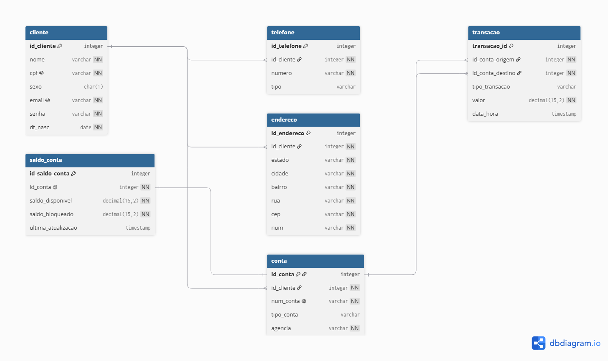

## 📐 Modelagem do NuClone

<i>Imagem do diagrama:</i>

### 📐 Decisões de Arquitetura e Modelagem (NuClone)

- **Isolamento de Estado Volátil (3FN):** Isolei a tabela de `saldo_conta` em uma relação 1:1 com a tabela `conta`. Essa abordagem mitiga problemas de concorrência em operações de escrita (updates de saldo) e simula a arquitetura de alta performance adotada por bancos reais, blindando os dados cadastrais estáticos.
- **Flexibilidade de Multi-contas (1:N):** O modelo suporta uma relação 1:N entre `cliente` e `conta`. Isso permite que um único cliente possua múltiplas contas correntes ou poupanças vinculadas ao seu perfil de forma escalável. O mesmo princípio foi aplicado para `telefone` e `endereco`.
- **Rastreabilidade de Transações:** Na tabela `transacao`, os campos `id_conta_origem` e `id_conta_destino` apontam diretamente para a chave primária da tabela `conta`. Isso garante que o fluxo financeiro seja rastreado no nível granular da conta bancária ativa, e não apenas no nível do cliente.
