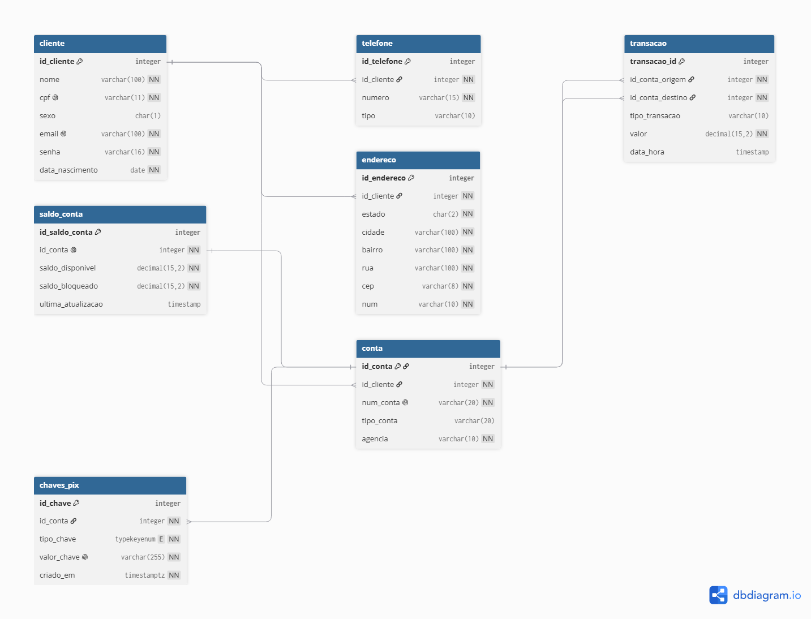

## 📐 Modelagem do NuClone

<i>Imagem do diagrama:</i>

### 📐 Decisões de Arquitetura e Modelagem (NuClone)

- **Isolamento de Estado Volátil (3FN):** Isolei a tabela de `saldo_conta` em uma relação 1:1 com a tabela `conta`. Essa abordagem mitiga problemas de concorrência em operações de escrita (updates de saldo) e simula a arquitetura de alta performance adotada por bancos reais, blindando os dados cadastrais estáticos.
- **Flexibilidade de Multi-contas (1:N):** O modelo suporta uma relação 1:N entre `cliente` e `conta`. Isso permite que um único cliente possua múltiplas contas correntes ou poupanças vinculadas ao seu perfil de forma escalável. O mesmo princípio foi aplicado para `telefone` e `endereco`.
- **Rastreabilidade de Transações:** Na tabela `transacao`, os campos `id_conta_origem` e `id_conta_destino` apontam diretamente para a chave primária da tabela `conta`. Isso garante que o fluxo financeiro seja rastreado no nível granular da conta bancária ativa, e não apenas no nível do cliente.

<i>"Evolução Arquitetural: Este projeto foi desmembrado de um repositório monolítico de estudos para um ecossistema de microsserviço dedicado, visando independência de deploy, isolamento de escopo e facilidade de manutenção seguindo boas práticas de Engenharia de Software."</i>

🏛️ Arquitetura da Aplicação

Arquitetura Modular (Package by Feature): O projeto adota o padrão de Monólito Modular organizando o código-fonte por domínios de negócio (modules/cliente, modules/pix, etc.). Essa abordagem reduz a carga cognitiva durante a manutenção, garante forte isolamento entre contextos e facilita a transição futura para uma arquitetura de microsserviços, caso haja necessidade de escala... 

📌 Atualização do Esquema de Banco de Dados — Módulo Pix

📖 Visão Geral
Esta atualização introduz o suporte à gestão de Chaves Pix na modelagem do banco de dados, permitindo a vinculação de múltiplas chaves a uma conta bancária (1:N). O modelo conceitual em DBML foi atualizado no dbdiagram.io para refletir essa melhoria.

🔄 Alterações Realizadas. 
Novo Enum: typekeyenum Criado para padronizar e restringir os tipos aceitos de chave Pix na aplicação:'CPF' 'EMAIL' 'TELEFONE' 'ALEATORIA'. 
Nova Tabela:  chaves_pix
Estrutura adicionada para armazenar os registros das chaves vinculadas às contas Índices e Relacionamentos. 
