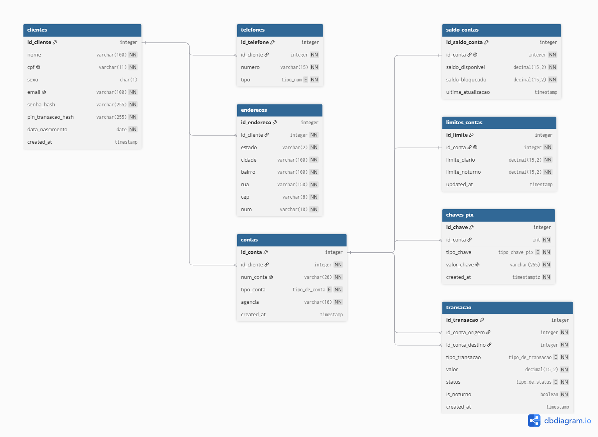

# 📐 Nuclone - API Core Banking & Ledger Pix

[](README.md)
[](https://www.python.org/)
[](https://fastapi.tiangolo.com/)
[](https://www.sqlalchemy.org/)

O Nuclone é uma API de Core Banking e sistema Pix de alta performance desenvolvida em Python 3.12 e FastAPI. O sistema simula a infraestrutura corporativa de instituições financeiras por meio de contabilidade de partidas dobradas (*double-entry ledger*), controle estrito de concorrência transacional, limites operacionais diurnos/noturnos dinâmicos e autenticação multi-tenant stateless baseada em JWT.

---

### 🏗️ Decisões Arquiteturais e Modelagem do Domínio

O sistema foi desenhado no padrão **Monólito Modular (Package by Feature)**, organizando o código-fonte estritamente por domínios de negócio (`modules/customer`, `modules/account`, `modules/pix`, `modules/ledger`). Este padrão reduz drasticamente a carga cognitiva, minimiza o acoplamento e fornece um caminho limpo para evolução para microsserviços, caso haja necessidade de escala.

#### Destaques de Engenharia:
- **Isolamento de Estado Volátil (3FN):** A entidade `account_balance` foi separada em uma relação 1:1 com a tabela `account`. Isso isola operações de escrita de alta frequência (atualizações de saldo) dos dados cadastrais estáticos, mitigando contenções por lock no banco de dados.
- **Flexibilidade Multi-Conta (1:N):** Suporta relacionamentos 1:N escaláveis entre `customer` e `account`, permitindo que um único cliente possua múltiplas contas ativas. A mesma estratégia se aplica às models de `phone` e `address`.
- **Rastreabilidade do Fluxo Financeiro:** A tabela de histórico `transaction` rastreia movimentações de forma granular no nível da conta bancária por meio de chaves estrangeiras diretas (`source_account_id` e `destination_account_id`), garantindo auditabilidade completa.
- **Controle de Concorrência e Segurança:** Implementação de lock pessimista (`SELECT FOR UPDATE`) durante transferências Pix para prevenir *race conditions* e inconsistências de saldo em execuções concorrentes.
- **Sistema de Extrato (Double-Entry Ledger):** Todas as movimentações monetárias são registradas como eventos imutáveis de débito e crédito, garantindo conformidade para a geração de extratos operacionais.
- **Limites Operacionais Dinâmicos:** Aplicação de regras de limites operacionais diurnos e noturnos por conta do cliente, alinhadas às diretrizes do BACEN.
- **Autenticação Stateless (IAM):** Integração com OAuth2 e Tokens JWT para contexto de identidade do usuário, protegendo endpoints e garantindo o isolamento de dados entre contas.

---

## 🛠️ Tecnologias Utilizadas

- **Linguagem & Framework:** Python 3.12, FastAPI
- **Banco de Dados & ORM:** SQLAlchemy 2.0 (ORM), PostgreSQL, SQLite (`:memory:` para suíte de testes)
- **Validação & Serialização:** Pydantic v2
- **Testes & Qualidade de Código:** Pytest, Pytest-Cov, HTTPX
- **Infraestrutura & Ferramentas:** Docker, Docker Compose, Postman

---

## 📊 Diagrama da arquitetura da base de dados e do domínio

<i>Imagem do diagrama</i>


```mermaid
graph TD
    Client[Cliente / Postman] -->|1. OAuth2 Bearer Token| Router[FastAPI Domain Routers]
    Router -->|2. Validar Identidade| AuthGuard[Auth Middleware / Security]
    Router -->|3. Checar Limites Operacionais| LimitService[Operational Limits Service]
    LimitService -->|4. Validar Regras| LimitDB[(Tabela de Limites)]
    Router -->|5. Executar Transferência com Lock| PixService[Pix Engine / Core Banking]
    PixService -->|6. Lançamento de Partidas Dobradas| LedgerDB[(Ledger Imutável)]